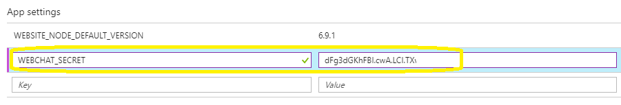
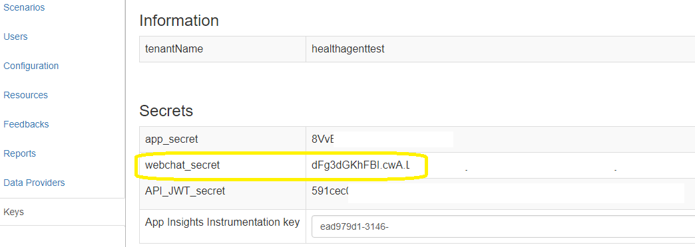

# Health Bot Ping Test

Send a single turn utterance to test the availability of the Health Bot. The bot will respond with a response according to the utterance.
HTTP error 500 will be returned if there is an error. To test success, you will need to compare the actual response with the expected response.

1. Deploy the website:

[![Deploy to Azure][Deploy Button]][Deploy Node/GetConversationMembers]

[Deploy Button]: https://azuredeploy.net/deploybutton.png
[Deploy Node/GetConversationMembers]: https://azuredeploy.net

2. Set the following enviorment variable: WEBCHAT_SECRET. 

You can obtain this secret from the Health Bot dashboard

3. To invoke the test, call endpoint of this service with /ping?utterance=hi

For example, to send the "hi" utterance, call the following endpoint with GET method
https://mypingtest.azurewebsites.net/ping?utterance=hi
